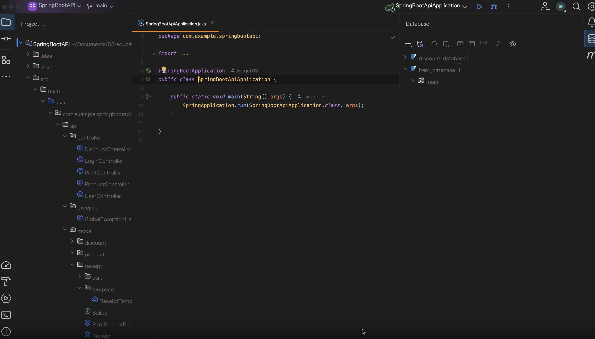
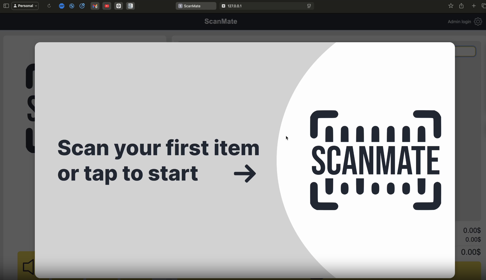

# ScanMate 1.0.0-X "Aurora"

# Web Programming required Part of README.md

## Grading

This project is a combination of two projects from two different courses: the frontend is intended for the Web Programming course, and the backend is for the Core Concepts of Software Engineering course. This has been discussed and confirmed with both instructors. The part to be graded should be limited solely to the portion of the project relevant to the specific course.

This project is a group effort by students Marven and Lars and should be evaluated as a group, not individually.


## Who did what?

All the code in this project was developed collaboratively by Marven and Lars as part of a group effort for the Web Programming & Core Concepts of Software Engineering courses at DHBW Karlsruhe. While the distribution of commits in the GitHub repository may not appear equal, this is because we worked together extensively over Discord, engaging in pair programming sessions where both students contributed equally to the design, coding, and problem-solving processes.


## Whats is the project about?

The project is a checkout system for a supermarket. It is a proof of concept and may not be fully functional or secure for real-world applications.

#
<br> <br>

# Detailed Backend Server Setup Guide

This guide provides step-by-step instructions for setting up and running the backend server for the ScanMate project. Please follow these steps carefully to ensure all components are installed correctly and the server runs smoothly.

## 0. Install Homebrew (for macOS)

Homebrew is a package manager for macOS that will make it easier to install dependencies like Java and Maven.

- If Homebrew is not already installed on your system, follow these steps:
  - Visit the [Homebrew website](https://brew.sh) for more information.
  - Run the following command in your terminal to install Homebrew:
    ```bash
    /bin/bash -c "$(curl -fsSL https://raw.githubusercontent.com/Homebrew/install/HEAD/install.sh)"
    ```
  - After installation, verify that Homebrew is installed by running:
    ```bash
    brew --version
    ```
  - If the version appears, Homebrew has been installed successfully.
    ```bash
    Output:
    Homebrew 4.4.6
    ```

## 1. Install Java (JDK 23)

The backend of this project requires Java (JDK 23). It is crucial that you install the correct version for compatibility.

- **macOS with Homebrew**:
  - Use Homebrew to install JDK 23 by running:
    ```bash
    brew install openjdk@23
    ```
  - Verify the Java version:
    ```bash
    java --version
    ```
    Expected output:
    ```
    openjdk 23 2024-09-17
    OpenJDK Runtime Environment (build 23+37-2369)
    OpenJDK 64-Bit Server VM (build 23+37-2369, mixed mode, sharing)
    ```
   optional if the java version is not set automatically:
  - After installation, set Java 23 as the default version by adding the following to your shell profile (e.g., `.zshrc` or `.bash_profile`):
    ```bash
    export PATH="/opt/homebrew/opt/openjdk@23/bin:$PATH"
    ```
  - Reload the profile with:
    ```bash
    source ~/.zshrc
    ```

- **Windows**:
  - Visit the [Java JDK 23 download page](https://jdk.java.net/23/).
  - Download the installer and follow the instructions to install.
  - Verify the installation by running the following command in Command Prompt:
    ```cmd
    java --version
    ```

## 2. Install Maven

Maven is a build automation tool used for Java projects, and it is required to run the backend server.

- **macOS with Homebrew**:
  - Install Maven by running:
    ```bash
    brew install maven
    ```
  - Verify Maven installation:
    ```bash
    mvn --version
    ```
    Expected output:
    ```
    Apache Maven 3.9.9 (8e8579a9e76f7d015ee5ec7bfcdc97d260186937)
    Maven home: /opt/homebrew/Cellar/maven/3.9.9/libexec
    Java version: 23.0.1, vendor: Homebrew, runtime: /opt/homebrew/Cellar/openjdk/23.0.1/libexec/openjdk.jdk/Contents/Home
    Default locale: en_US, platform encoding: UTF-8
    OS name: "mac os x", version: "15.2", arch: "aarch64", family: "Mac"
    ```

- **Windows**:
  - Visit the [Maven download page](https://maven.apache.org/download.cgi).
  - Download the ZIP file and extract it to a preferred directory (e.g., `C:\Program Files\Maven`).
  - Add the `bin` directory of Maven to your `PATH` environment variable.
  - Verify Maven installation by running:
    ```cmd
    mvn --version
    ```

## 3. Download the Project Repository

- Go to the GitHub repository: [SelfCheckout-CoSE-WebProg](https://github.com/lzieger03/SelfCheckout-CoSE-WebProg).
- Click on the "Code" button and select "Download ZIP".
- Extract the ZIP file to a location of your choice.

## 4. Navigate to the Backend Directory

- Open a terminal (macOS) or Command Prompt (Windows).
- Navigate to the `backend/SpringBootAPI` folder of the extracted project directory. Use the `cd` command:
  ```bash
  cd path/to/extracted-folder/location/backend/SpringBootAPI
  ```
- Run the following command to start the backend server, ensure that you run this command from the `backend/SpringBootAPI` directory:
  ```bash
  mvn spring-boot:run
  ```

** If an error occurs during the first run, simply run the command again, and it should work. Once completed, the server will start automatically and the logs will be displayed in the terminal.**

# Frontend Setup Guide using Live Server (VSCode)

## 6. Install Visual Studio Code (VSCode)

To work with the frontend part of the project, you will need Visual Studio Code.

- **Download and Install VSCode**:
  - Visit the [Visual Studio Code download page](https://code.visualstudio.com/Download).
  - Download and follow the installation instructions for your operating system.

- **Install the "Live Server" Plugin**:
  - Open VSCode and go to the Extensions view by clicking on the Extensions icon in the Activity Bar or pressing `Ctrl+Shift+X`.
  - Search for "Live Server" by `ritwickdey` and click "Install".

## 7. Run the Frontend

1. Open the project folder in VSCode by selecting "File > Open Folder" and navigate to the extracted project directory.
2. Navigate to the `frontend` folder.
3. Right-click on `index.html` and select "Open with Live Server".
4. make sure the Frontend Live Server is running on port `5501`. You can check this in the bottom right corner of the VSCode window. <br> If the port is not `5501`, you can change the port in the settings or create a new `settings.json` file in the `.vscode` folder and add the following lines: 
  ```json
  {
    "liveServer.settings.port": 5501
   }
  ```
5. A browser window will open displaying the ScanMate site. You can now interact with the system by entering barcodes, inputting discount codes, or logging into the admin view.

## Additional Notes

- Ensure that both the backend and frontend are running simultaneously for the full application to work.
- The backend must be running on port `8080`, and the Live Server for the frontend should run on port `5501`.
- If any errors occur, verify the compatibility of Java and Maven versions as specified in the installation steps.

## Troubleshooting

- **Java or Maven Command Not Found**: Make sure the installation paths have been correctly added to your system's `PATH` environment variable.
- **Backend Server Not Starting**: Check the terminal for error messages. Ensure that all dependencies are installed, and the Java version is correct.
- **Frontend Not Loading Properly**: Confirm that the backend server is running before starting the Live Server.

#
<br> <br><br> <br>

### How to start ScanMate

[](./Attachments/howToStartScanMate.mp4)


### How to use ScanMate

[](./Attachments/howToUseScanMate.mp4)


## Item numbers and discount codes for quick usage or test purposes
### Item numbers

- 8156679408476 (Apple)
- 6270917051323 (Banana)
- 1183820248147 (Orange)

### Discount codes

- SALE15 for 15% discount
- EXTRA50 for 50% discount
- TEST100 for free shopping


#
#
#


## What's This About?

Welcome to the ScanMate 1.0.0-X "Aurora" project! This is all about making your supermarket checkout experience as smooth as possible. Imagine walking up to a kiosk, scanning your items, choosing how you want to pay, and getting a receipt—all without waiting in line. That's what we're building here.


## How It Works

- **Scan Your Stuff**: Use a barcode scanner to add items to your cart or manually input the barcode. Each item pops up with its name and price.
- **Pay Your Way**: Whether you're a cash person or a card swiper, we've got you covered. The system guides you through the payment process.
- **Get Your Receipt**: Once you pay, a receipt prints out with all the details—what you bought, how much it cost, and how you paid.


## What's Under the Hood?

- **Frontend**: Built with HTML, CSS, and JavaScript. It's the face of the system where all the action happens.
- **Backend**: Powered by Java and Spring Boot. This is where the magic happens—handling all the data and logic.
- **Database**: A SQLite Database keeps track of all the product info, like barcodes, names, and prices.


## Project Structure

Here's how the project is organized:

1. **Frontend**:
   - **HTML**: The main interface is defined in `index.html`, which includes various sections for product display, barcode input, and payment options.
   - **CSS**: Styling is managed in `styles.css`, providing layout and design for the application.
   - **JavaScript**: Scripts like `barcode-script.js` handle barcode scanning and interaction logic.

2. **Backend**:
   - **Java**: The backend is built using Spring Boot, with configurations like `WebConfig.java` to manage CORS settings.
   - **Database**: The application uses a SQLite database, `item_database.db`, to store product information.

3. **Configuration**:
   - **Maven**: The project uses Maven for dependency management, as specified in `pom.xml`.
   - **Git**: The `.gitignore` file ensures that unnecessary files are not tracked in version control.


## The Big Picture

This project is a full-stack application, meaning we're covering everything from the user interface to the database. It's a great way to dive into modern web development and see how all the pieces fit together.

## Why Do It?

We're aiming to cut down on wait times and make shopping a breeze. Plus, it's a fun way to learn about building a complete application from scratch.

## The Team

We're a dynamic duo of student developers, Marven Drechsel and Lars Zieger, working together on both the frontend and backend aspects of the project. This project is part of our coursework for a lecture at DHBW Karlsruhe, where we're learning to integrate various technologies into a cohesive application. It's all about collaboration and learning as we tackle every part of the system together.

## Wrap-Up

In a nutshell, ScanMate 1.0.0-X "Aurora" is about creating a checkout experience that's fast, friendly, and accessible to everyone. Whether you're a developer looking to learn or a shopper wanting a better checkout, this project has something for you.


# Disclaimer

## General 
This project is a learning exercise and is not intended for production use. It is a proof of concept and may not be fully functional or secure for real-world applications.

### Security
The backend is not secured and does not use HTTPS. It is intended for local use only.

### Database
The database is not backed up and does not use a remote database. It is intended for local use only.

### Discounts
The discount system is not secured and does not use a remote discount database. It is intended for local use only.

### Barcodes
The barcode system is not secured and does not use a remote barcode database. It is intended for local use only.

### Payment
The payment system is not secured and does not use a remote payment processor. It is intended for local use only.

### Receipts
The receipt system is not secured and does not use a remote receipt printer. It is intended for local use only.

### Accessibility
The accessibility features are not fully implemented and do not provide full accessibility support. This is a known limitation, but will not be implemented in this version.


## Further Information

For further information, please view [Disclaimer.md](Disclaimer.md) and [Legal.md](Legal.md) or contact the project team.

